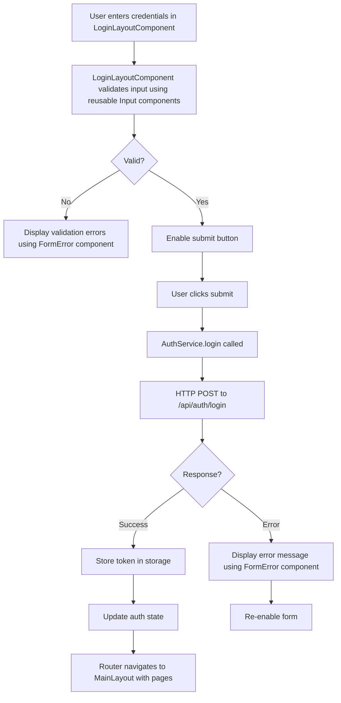

# Design Document: Login Feature

## Overview

The login feature provides secure user authentication for the Angular application. It consists of a reactive form-based login component, an authentication service for API communication and token management, form validators for input validation, route guards for access control, and integration with Angular's routing system.

The implementation follows Angular best practices using reactive forms, RxJS for asynchronous operations, and Angular's dependency injection system. The design emphasizes security, user experience, and maintainability while adhering to the visual specifications from the Figma design system.

### Key Design Principles

- **Security First**: Secure token storage, HTTPS-only communication, protection against common vulnerabilities
- **User Experience**: Immediate validation feedback, clear error messages, loading states, accessibility compliance
- **Maintainability**: Separation of concerns, testable components, clear interfaces
- **Responsiveness**: Mobile-first design with breakpoints at 768px and 1024px
- **Accessibility**: WCAG 2.1 AA compliance with keyboard navigation and screen reader support

## Architecture

### Component Structure

```
src/app/
├── components/                    # Reusable UI components
│   ├── button/
│   │   ├── button.component.ts
│   │   ├── button.component.html
│   │   ├── button.component.css
│   │   └── button.component.spec.ts
│   ├── input/
│   │   ├── input.component.ts
│   │   ├── input.component.html
│   │   ├── input.component.css
│   │   └── input.component.spec.ts
│   ├── form-error/
│   │   ├── form-error.component.ts
│   │   ├── form-error.component.html
│   │   ├── form-error.component.css
│   │   └── form-error.component.spec.ts
│   └── loading-spinner/
│       ├── loading-spinner.component.ts
│       ├── loading-spinner.component.html
│       ├── loading-spinner.component.css
│       └── loading-spinner.component.spec.ts
├── auth/                          # Authentication module
│   ├── layouts/
│   │   ├── auth-layout/
│   │   │   ├── auth-layout.component.ts
│   │   │   ├── auth-layout.component.html
│   │   │   ├── auth-layout.component.css
│   │   │   └── auth-layout.component.spec.ts
│   │   ├── login-layout/
│   │   │   ├── login-layout.component.ts
│   │   │   ├── login-layout.component.html
│   │   │   ├── login-layout.component.css
│   │   │   └── login-layout.component.spec.ts
│   │   └── reset-password-layout/
│   │       ├── reset-password-layout.component.ts
│   │       ├── reset-password-layout.component.html
│   │       ├── reset-password-layout.component.css
│   │       └── reset-password-layout.component.spec.ts
│   ├── services/
│   │   ├── auth.service.ts
│   │   └── auth.service.spec.ts
│   ├── guards/
│   │   ├── auth.guard.ts
│   │   └── auth.guard.spec.ts
│   ├── interceptors/
│   │   ├── auth.interceptor.ts
│   │   └── auth.interceptor.spec.ts
│   ├── models/
│   │   ├── user.model.ts
│   │   ├── auth-request.model.ts
│   │   └── auth-response.model.ts
│   └── validators/
│       ├── email.validator.ts
│       └── password.validator.ts
├── main/                          # Main application layout
│   ├── main-layout/
│   │   ├── main-layout.component.ts
│   │   ├── main-layout.component.html
│   │   ├── main-layout.component.css
│   │   └── main-layout.component.spec.ts
│   └── pages/
│       ├── dashboard/
│       │   ├── dashboard.component.ts
│       │   ├── dashboard.component.html
│       │   ├── dashboard.component.css
│       │   └── dashboard.component.spec.ts
│       └── home/
│           ├── home.component.ts
│           ├── home.component.html
│           ├── home.component.css
│           └── home.component.spec.ts
└── app-routing.module.ts (updated)
```

### Module Organization

The application will be organized into three main feature modules:

**ComponentsModule** (Shared):
- Contains all reusable UI components (Button, Input, FormError, LoadingSpinner)
- **Standalone**: false
- **Imports**: CommonModule
- **Exports**: All component declarations for use in other modules

**AuthModule**:
- Contains authentication layouts, services, guards, and interceptors
- **Standalone**: false
- **Imports**: ReactiveFormsModule, CommonModule, RouterModule, ComponentsModule
- **Providers**: AuthService, AuthGuard, AuthInterceptor
- **Declarations**: AuthLayoutComponent, LoginLayoutComponent, ResetPasswordLayoutComponent
- **Routes**: /login, /reset-password

**MainModule**:
- Contains main application layout and page components
- **Standalone**: false
- **Imports**: CommonModule, RouterModule, ComponentsModule
- **Declarations**: MainLayoutComponent, DashboardComponent, HomeComponent
- **Routes**: Protected routes using MainLayoutComponent as wrapper

### Data Flow



### State Management

The authentication state will be managed using RxJS BehaviorSubjects within the AuthService:

- **currentUser$**: Observable<User | null> - Emits the currently authenticated user
- **isAuthenticated$**: Observable<boolean> - Emits authentication status
- **authToken**: string | null - Private token storage (not exposed as observable for security)

## Components and Interfaces

### Reusable Components

#### ButtonComponent

**Responsibility**: Reusable button component with loading state and disabled state support.

**Template Structure**:
```html
<button 
  [type]="type"
  [disabled]="disabled || loading"
  [class]="buttonClasses"
  (click)="handleClick($event)">
  <span *ngIf="loading" class="loading-spinner"></span>
  <span [class.hidden]="loading">
    <ng-content></ng-content>
  </span>
</button>
```

**Component Class**:
```typescript
@Component({
  selector: 'app-button',
  templateUrl: './button.component.html',
  styleUrls: ['./button.component.css']
})
export class ButtonComponent {
  @Input() type: 'button' | 'submit' | 'reset' = 'button';
  @Input() disabled = false;
  @Input() loading = false;
  @Input() variant: 'primary' | 'secondary' | 'danger' = 'primary';
  @Output() clicked = new EventEmitter<Event>();

  get buttonClasses(): string {
    const base = 'btn';
    const variantClass = `btn-${this.variant}`;
    const loadingClass = this.loading ? 'btn-loading' : '';
    return `${base} ${variantClass} ${loadingClass}`.trim();
  }

  handleClick(event: Event): void {
    if (!this.disabled && !this.loading) {
      this.clicked.emit(event);
    }
  }
}
```

#### InputComponent

**Responsibility**: Reusable input component with label, error display, and various input types.

**Template Structure**:
```html
<div class="input-wrapper">
  <label [for]="id" *ngIf="label">{{ label }}</label>
  <div class="input-container">
    <input
      [id]="id"
      [type]="type"
      [placeholder]="placeholder"
      [value]="value"
      [disabled]="disabled"
      [attr.aria-label]="ariaLabel || label"
      [attr.aria-required]="required"
      [attr.aria-invalid]="hasError"
      [attr.aria-describedby]="hasError ? id + '-error' : null"
      (input)="onInput($event)"
      (blur)="onBlur()"
      (focus)="onFocus()"
    />
    <ng-content select="[suffix]"></ng-content>
  </div>
  <app-form-error 
    *ngIf="hasError && errorMessage"
    [id]="id + '-error'"
    [message]="errorMessage">
  </app-form-error>
</div>
```

**Component Class**:
```typescript
@Component({
  selector: 'app-input',
  templateUrl: './input.component.html',
  styleUrls: ['./input.component.css']
})
export class InputComponent {
  @Input() id!: string;
  @Input() type: 'text' | 'email' | 'password' | 'number' = 'text';
  @Input() label?: string;
  @Input() placeholder = '';
  @Input() value = '';
  @Input() disabled = false;
  @Input() required = false;
  @Input() hasError = false;
  @Input() errorMessage?: string;
  @Input() ariaLabel?: string;
  @Output() valueChange = new EventEmitter<string>();
  @Output() blurred = new EventEmitter<void>();
  @Output() focused = new EventEmitter<void>();

  onInput(event: Event): void {
    const target = event.target as HTMLInputElement;
    this.value = target.value;
    this.valueChange.emit(this.value);
  }

  onBlur(): void {
    this.blurred.emit();
  }

  onFocus(): void {
    this.focused.emit();
  }
}
```

#### FormErrorComponent

**Responsibility**: Display validation error messages with proper ARIA support.

**Template Structure**:
```html
<div 
  [id]="id"
  class="form-error"
  role="alert"
  aria-live="polite">
  {{ message }}
</div>
```

**Component Class**:
```typescript
@Component({
  selector: 'app-form-error',
  templateUrl: './form-error.component.html',
  styleUrls: ['./form-error.component.css']
})
export class FormErrorComponent {
  @Input() id?: string;
  @Input() message!: string;
}
```

#### LoadingSpinnerComponent

**Responsibility**: Display loading indicator.

**Template Structure**:
```html
<div class="spinner" [attr.aria-label]="ariaLabel || 'Loading'"></div>
```

**Component Class**:
```typescript
@Component({
  selector: 'app-loading-spinner',
  templateUrl: './loading-spinner.component.html',
  styleUrls: ['./loading-spinner.component.css']
})
export class LoadingSpinnerComponent {
  @Input() ariaLabel?: string;
}
```

### Authentication Layouts

#### AuthLayoutComponent

**Responsibility**: Wrapper layout for all authentication pages (login, reset password) with shared styling and branding.

**Template Structure**:
```html
<div class="auth-container">
  <div class="auth-card">
    <div class="auth-header">
      
      <h1>{{ title }}</h1>
    </div>
    <div class="auth-content">
      <router-outlet></router-outlet>
    </div>
    <div class="auth-footer">
      <p>&copy; 2026 Your Company. All rights reserved.</p>
    </div>
  </div>
</div>
```

**Component Class**:
```typescript
@Component({
  selector: 'app-auth-layout',
  templateUrl: './auth-layout.component.html',
  styleUrls: ['./auth-layout.component.css']
})
export class AuthLayoutComponent implements OnInit {
  title = '';

  constructor(private router: Router) {}

  ngOnInit(): void {
    this.updateTitle();
    this.router.events.pipe(
      filter(event => event instanceof NavigationEnd)
    ).subscribe(() => this.updateTitle());
  }

  private updateTitle(): void {
    const url = this.router.url;
    if (url.includes('login')) {
      this.title = 'Login';
    } else if (url.includes('reset-password')) {
      this.title = 'Reset Password';
    }
  }
}
```

#### LoginLayoutComponent

**Responsibility**: Render the login form using reusable components and coordinate with AuthService.

**Template Structure**:
```html
<form [formGroup]="loginForm" (ngSubmit)="onSubmit()">
  <app-input
    id="email"
    type="email"
    label="Email"
    placeholder="Enter your email"
    formControlName="email"
    [hasError]="!!emailErrors"
    [errorMessage]="emailErrors"
    [required]="true">
  </app-input>

  <app-input
    id="password"
    [type]="passwordVisible ? 'text' : 'password'"
    label="Password"
    placeholder="Enter your password"
    formControlName="password"
    [hasError]="!!passwordErrors"
    [errorMessage]="passwordErrors"
    [required]="true">
    <button 
      type="button" 
      suffix
      class="password-toggle"
      (click)="togglePasswordVisibility()"
      [attr.aria-label]="passwordVisible ? 'Hide password' : 'Show password'">
      <span class="icon">{{ passwordVisible ? '👁️' : '👁️‍🗨️' }}</span>
    </button>
  </app-input>

  <div class="form-group" *ngIf="showRememberMe">
    <label class="checkbox-label">
      <input type="checkbox" formControlName="rememberMe" />
      <span>Remember Me</span>
    </label>
  </div>

  <app-form-error 
    *ngIf="authError"
    [message]="authError">
  </app-form-error>

  <app-button
    type="submit"
    variant="primary"
    [disabled]="!loginForm.valid"
    [loading]="isLoading">
    Login
  </app-button>

  <div class="auth-links">
    <a routerLink="/reset-password">Forgot password?</a>
  </div>
</form>
```

**Component Class**:
```typescript
@Component({
  selector: 'app-login-layout',
  templateUrl: './login-layout.component.html',
  styleUrls: ['./login-layout.component.css']
})
export class LoginLayoutComponent implements OnInit, OnDestroy {
  loginForm: FormGroup;
  isLoading = false;
  passwordVisible = false;
  authError: string | null = null;
  showRememberMe = true;
  private destroy$ = new Subject<void>();

  constructor(
    private fb: FormBuilder,
    private authService: AuthService,
    private router: Router,
    private route: ActivatedRoute
  ) {
    this.loginForm = this.fb.group({
      email: ['', [Validators.required, Validators.email]],
      password: ['', [Validators.required, Validators.minLength(1)]],
      rememberMe: [false]
    });
  }

  ngOnInit(): void {
    this.checkExistingAuth();
  }

  onSubmit(): void {
    if (this.loginForm.valid && !this.isLoading) {
      this.isLoading = true;
      this.authError = null;
      
      const { email, password, rememberMe } = this.loginForm.value;
      
      this.authService.login(email, password, rememberMe)
        .pipe(takeUntil(this.destroy$))
        .subscribe({
          next: () => this.handleLoginSuccess(),
          error: (error) => this.handleLoginError(error)
        });
    }
  }

  togglePasswordVisibility(): void {
    this.passwordVisible = !this.passwordVisible;
  }

  get emailErrors(): string | null {
    const control = this.loginForm.get('email');
    if (control?.invalid && (control.dirty || control.touched)) {
      if (control.errors?.['required']) return 'Email is required';
      if (control.errors?.['email']) return 'Please enter a valid email';
    }
    return null;
  }

  get passwordErrors(): string | null {
    const control = this.loginForm.get('password');
    if (control?.invalid && (control.dirty || control.touched)) {
      if (control.errors?.['required']) return 'Password is required';
    }
    return null;
  }

  private handleLoginSuccess(): void {
    this.isLoading = false;
    const returnUrl = this.route.snapshot.queryParams['returnUrl'] || '/';
    this.router.navigate([returnUrl]);
  }

  private handleLoginError(error: any): void {
    this.isLoading = false;
    this.authError = this.getErrorMessage(error);
  }

  private getErrorMessage(error: any): string {
    if (error.status === 401) {
      return 'Invalid email or password';
    } else if (error.status === 0 || error.status === 504) {
      return 'Unable to connect. Please try again.';
    } else {
      return 'An error occurred. Please try again later.';
    }
  }

  private checkExistingAuth(): void {
    if (this.authService.isAuthenticated()) {
      this.router.navigate(['/']);
    }
  }

  ngOnDestroy(): void {
    this.destroy$.next();
    this.destroy$.complete();
  }
}
```

#### ResetPasswordLayoutComponent

**Responsibility**: Render the reset password form (placeholder for future implementation).

**Template Structure**:
```html
<form [formGroup]="resetForm" (ngSubmit)="onSubmit()">
  <app-input
    id="email"
    type="email"
    label="Email"
    placeholder="Enter your email"
    formControlName="email"
    [hasError]="!!emailErrors"
    [errorMessage]="emailErrors"
    [required]="true">
  </app-input>

  <app-form-error 
    *ngIf="resetError"
    [message]="resetError">
  </app-form-error>

  <app-button
    type="submit"
    variant="primary"
    [disabled]="!resetForm.valid"
    [loading]="isLoading">
    Send Reset Link
  </app-button>

  <div class="auth-links">
    <a routerLink="/login">Back to Login</a>
  </div>
</form>
```

**Component Class**:
```typescript
@Component({
  selector: 'app-reset-password-layout',
  templateUrl: './reset-password-layout.component.html',
  styleUrls: ['./reset-password-layout.component.css']
})
export class ResetPasswordLayoutComponent implements OnInit {
  resetForm: FormGroup;
  isLoading = false;
  resetError: string | null = null;

  constructor(
    private fb: FormBuilder,
    private authService: AuthService
  ) {
    this.resetForm = this.fb.group({
      email: ['', [Validators.required, Validators.email]]
    });
  }

  ngOnInit(): void {}

  onSubmit(): void {
    if (this.resetForm.valid && !this.isLoading) {
      this.isLoading = true;
      this.resetError = null;
      // TODO: Implement reset password logic
      console.log('Reset password for:', this.resetForm.value.email);
      setTimeout(() => {
        this.isLoading = false;
        this.resetError = 'Reset password functionality not yet implemented';
      }, 1000);
    }
  }

  get emailErrors(): string | null {
    const control = this.resetForm.get('email');
    if (control?.invalid && (control.dirty || control.touched)) {
      if (control.errors?.['required']) return 'Email is required';
      if (control.errors?.['email']) return 'Please enter a valid email';
    }
    return null;
  }
}
```

### Main Layout

#### MainLayoutComponent

**Responsibility**: Wrapper layout for authenticated pages with navigation, header, and footer.

**Template Structure**:
```html
<div class="main-layout">
  <header class="main-header">
    <div class="header-content">
      
      <nav class="main-nav">
        <a routerLink="/dashboard" routerLinkActive="active">Dashboard</a>
        <a routerLink="/home" routerLinkActive="active">Home</a>
      </nav>
      <div class="user-menu">
        <span>{{ currentUser?.name }}</span>
        <button (click)="logout()">Logout</button>
      </div>
    </div>
  </header>
  
  <main class="main-content">
    <router-outlet></router-outlet>
  </main>
  
  <footer class="main-footer">
    <p>&copy; 2026 Your Company. All rights reserved.</p>
  </footer>
</div>
```

**Component Class**:
```typescript
@Component({
  selector: 'app-main-layout',
  templateUrl: './main-layout.component.html',
  styleUrls: ['./main-layout.component.css']
})
export class MainLayoutComponent implements OnInit, OnDestroy {
  currentUser: User | null = null;
  private destroy$ = new Subject<void>();

  constructor(
    private authService: AuthService,
    private router: Router
  ) {}

  ngOnInit(): void {
    this.authService.currentUser$
      .pipe(takeUntil(this.destroy$))
      .subscribe(user => this.currentUser = user);
  }

  logout(): void {
    this.authService.logout();
    this.router.navigate(['/login']);
  }

  ngOnDestroy(): void {
    this.destroy$.next();
    this.destroy$.complete();
  }
}
```

### LoginComponent

### AuthService

**Responsibility**: Handle authentication logic, API communication, token management, and authentication state.

**Interface**:
```typescript
export class AuthService {
  private readonly API_URL = '/api/auth';
  private readonly TOKEN_KEY = 'auth_token';
  private currentUserSubject = new BehaviorSubject<User | null>(null);
  private isAuthenticatedSubject = new BehaviorSubject<boolean>(false);

  public currentUser$ = this.currentUserSubject.asObservable();
  public isAuthenticated$ = this.isAuthenticatedSubject.asObservable();

  constructor(private http: HttpClient) {
    this.initializeAuth();
  }

  login(email: string, password: string, rememberMe: boolean): Observable<AuthResponse> {
    const request: AuthRequest = { email, password };
    
    return this.http.post<AuthResponse>(`${this.API_URL}/login`, request).pipe(
      tap(response => {
        this.storeToken(response.token, rememberMe);
        this.currentUserSubject.next(response.user);
        this.isAuthenticatedSubject.next(true);
      }),
      catchError(error => {
        this.handleAuthError(error);
        return throwError(() => error);
      })
    );
  }

  logout(): void {
    this.clearToken();
    this.currentUserSubject.next(null);
    this.isAuthenticatedSubject.next(false);
  }

  isAuthenticated(): boolean {
    return this.getToken() !== null;
  }

  getToken(): string | null {
    return localStorage.getItem(this.TOKEN_KEY) || sessionStorage.getItem(this.TOKEN_KEY);
  }

  private storeToken(token: string, rememberMe: boolean): void {
    if (rememberMe) {
      localStorage.setItem(this.TOKEN_KEY, token);
    } else {
      sessionStorage.setItem(this.TOKEN_KEY, token);
    }
  }

  private clearToken(): void {
    localStorage.removeItem(this.TOKEN_KEY);
    sessionStorage.removeItem(this.TOKEN_KEY);
  }

  private initializeAuth(): void {
    const token = this.getToken();
    if (token) {
      // Validate token and load user data
      this.validateToken(token).subscribe({
        next: (user) => {
          this.currentUserSubject.next(user);
          this.isAuthenticatedSubject.next(true);
        },
        error: () => {
          this.clearToken();
        }
      });
    }
  }

  private validateToken(token: string): Observable<User> {
    return this.http.get<User>(`${this.API_URL}/validate`);
  }

  private handleAuthError(error: any): void {
    console.error('Authentication error:', error);
  }
}
```

### AuthGuard

**Responsibility**: Protect routes from unauthorized access and redirect to login when needed.

**Implementation**:
```typescript
export class AuthGuard implements CanActivate {
  constructor(
    private authService: AuthService,
    private router: Router
  ) {}

  canActivate(
    route: ActivatedRouteSnapshot,
    state: RouterStateSnapshot
  ): boolean {
    if (this.authService.isAuthenticated()) {
      return true;
    }

    // Store the attempted URL for redirecting after login
    this.router.navigate(['/login'], {
      queryParams: { returnUrl: state.url }
    });
    return false;
  }
}
```

### AuthInterceptor

**Responsibility**: Automatically attach authentication tokens to outgoing HTTP requests.

**Implementation**:
```typescript
export class AuthInterceptor implements HttpInterceptor {
  constructor(private authService: AuthService) {}

  intercept(req: HttpRequest<any>, next: HttpHandler): Observable<HttpEvent<any>> {
    const token = this.authService.getToken();
    
    if (token) {
      const cloned = req.clone({
        headers: req.headers.set('Authorization', `Bearer ${token}`)
      });
      return next.handle(cloned);
    }
    
    return next.handle(req);
  }
}
```

## Data Models

### User Model

```typescript
export interface User {
  id: string;
  email: string;
  name: string;
  roles: string[];
  createdAt: Date;
}
```

### AuthRequest Model

```typescript
export interface AuthRequest {
  email: string;
  password: string;
}
```

### AuthResponse Model

```typescript
export interface AuthResponse {
  token: string;
  user: User;
  expiresIn: number;
}
```

### LoginFormValue Model

```typescript
export interface LoginFormValue {
  email: string;
  password: string;
  rememberMe: boolean;
}
```

## Correctness Properties

*A property is a characteristic or behavior that should hold true across all valid executions of a system—essentially, a formal statement about what the system should do. Properties serve as the bridge between human-readable specifications and machine-verifiable correctness guarantees.*

Before writing the correctness properties, I need to analyze the acceptance criteria to determine which are testable as properties.


### Property Reflection

After analyzing all acceptance criteria, I identified the following properties that are suitable for property-based testing:

**Properties identified:**
1. Email validation (2.1) - Test email validation across random inputs
2. Error message display (2.3) - Test error messages appear for invalid inputs
3. Submit button disabled state (2.5) - Test button state matches form validity
4. API call with credentials (3.1) - Test API calls are made correctly
5. Token storage (3.4, 8.1) - Test tokens are stored correctly
6. Password toggle round-trip (5.2, 5.3) - Test toggle behavior
7. Remember Me storage logic (8.2, 8.3) - Test conditional storage
8. Auto-authentication (8.4) - Test auto-auth with valid tokens
9. Return URL redirect (9.2) - Test redirect to returnUrl
10. Form state updates (10.1) - Test form state reflects input
11. Form values persist after error (10.4) - Test values maintained after error

**Redundancy analysis:**
- Properties 8.2 and 8.3 can be combined into a single property testing conditional storage based on rememberMe flag
- Properties 5.2 and 5.3 are already combined as a round-trip property
- Properties 3.4 and 8.1 are testing the same behavior and can be combined
- Property 2.3 and the error message display can be combined with form validation testing

**Final properties after reflection:**
1. Email validation across random inputs
2. Submit button state matches form validity
3. API authentication request with correct parameters
4. Token storage based on rememberMe flag
5. Password visibility toggle round-trip
6. Auto-authentication with valid stored tokens
7. Return URL redirect after successful login
8. Form state updates reflect user input
9. Form values persist after authentication errors

### Property 1: Email Validation

*For any* string input to the email field, the form validator SHALL correctly identify valid email formats and reject invalid formats according to standard email validation rules.

**Validates: Requirements 2.1**

### Property 2: Submit Button State Reflects Form Validity

*For any* combination of form input values (email, password), the submit button disabled state SHALL match the form's validity state (disabled when invalid, enabled when valid).

**Validates: Requirements 2.5**

### Property 3: Authentication API Request

*For any* valid email and password combination, when the login form is submitted, the AuthService SHALL make an HTTP POST request to the correct endpoint with the credentials in the request body.

**Validates: Requirements 3.1**

### Property 4: Token Storage Based on Remember Me

*For any* authentication token and rememberMe boolean value, the AuthService SHALL store the token in localStorage when rememberMe is true and in sessionStorage when rememberMe is false.

**Validates: Requirements 8.2, 8.3**

### Property 5: Password Visibility Toggle Round-Trip

*For any* password visibility state, toggling the visibility twice SHALL return the password field to its original state (hidden → visible → hidden, or visible → hidden → visible).

**Validates: Requirements 5.2, 5.3**

### Property 6: Auto-Authentication with Valid Token

*For any* valid authentication token stored in browser storage, when the application initializes, the AuthService SHALL automatically authenticate the user and set the authentication state to true.

**Validates: Requirements 8.4**

### Property 7: Return URL Redirect

*For any* valid URL path stored as a returnUrl query parameter, after successful authentication, the Router SHALL navigate to that URL path.

**Validates: Requirements 9.2**

### Property 8: Form State Updates

*For any* input value entered in the email or password fields, the form state SHALL immediately reflect the new value in the form control's value property.

**Validates: Requirements 10.1**

### Property 9: Form Values Persist After Error

*For any* form input values (email, password, rememberMe), when an authentication error occurs, the form SHALL maintain all input values unchanged.

**Validates: Requirements 10.4**

## Error Handling

### Validation Errors

**Client-Side Validation**:
- Email format validation using Angular's built-in email validator
- Required field validation for email and password
- Real-time validation feedback as user types (after field is touched)
- Error messages displayed below each field
- Submit button disabled when form is invalid

**Error Message Mapping**:
```typescript
const VALIDATION_ERRORS = {
  email: {
    required: 'Email is required',
    email: 'Please enter a valid email'
  },
  password: {
    required: 'Password is required'
  }
};
```

### Authentication Errors

**HTTP Error Handling**:
- 401 Unauthorized → "Invalid email or password"
- 0 or 504 Network Error → "Unable to connect. Please try again."
- 500+ Server Error → "An error occurred. Please try again later."
- Timeout → "Request timed out. Please try again."

**Error Recovery**:
- Form remains enabled after error
- User input values are preserved
- Loading state is reset
- Error message is displayed prominently
- User can immediately retry

**Error Display**:
- Authentication errors displayed above the submit button
- Validation errors displayed below each field
- ARIA live regions announce errors to screen readers
- Error messages use semantic color (red) with sufficient contrast

### Token Expiration

**Handling Expired Tokens**:
```typescript
private handleTokenExpiration(): void {
  this.clearToken();
  this.currentUserSubject.next(null);
  this.isAuthenticatedSubject.next(false);
  this.router.navigate(['/login'], {
    queryParams: { message: 'Session expired. Please log in again.' }
  });
}
```

**Token Validation**:
- Tokens validated on application initialization
- Invalid or expired tokens cleared from storage
- User redirected to login page
- Optional message displayed explaining session expiration

### Network Resilience

**Timeout Configuration**:
```typescript
private readonly HTTP_TIMEOUT = 30000; // 30 seconds

login(email: string, password: string, rememberMe: boolean): Observable<AuthResponse> {
  return this.http.post<AuthResponse>(`${this.API_URL}/login`, { email, password })
    .pipe(
      timeout(this.HTTP_TIMEOUT),
      retry({ count: 0, delay: 0 }), // No automatic retry
      catchError(this.handleError)
    );
}
```

**Offline Detection**:
- Check navigator.onLine before making requests
- Display appropriate message if offline
- Provide retry mechanism when connection restored

## Testing Strategy

### Dual Testing Approach

The login feature will use both unit tests and property-based tests to ensure comprehensive coverage:

**Unit Tests**: Verify specific examples, edge cases, error conditions, and UI behavior
**Property Tests**: Verify universal properties across randomized inputs

### Property-Based Testing Configuration

**Library**: fast-check (JavaScript/TypeScript property-based testing library)
**Installation**: `npm install --save-dev fast-check`
**Minimum Iterations**: 100 runs per property test
**Tag Format**: Each property test will include a comment referencing the design property

Example:
```typescript
// Feature: login-feature, Property 1: Email Validation
it('should validate email format for any input string', () => {
  fc.assert(
    fc.property(fc.string(), (input) => {
      const isValid = emailValidator(input);
      const expectedValid = /^[^\s@]+@[^\s@]+\.[^\s@]+$/.test(input);
      expect(isValid).toBe(expectedValid);
    }),
    { numRuns: 100 }
  );
});
```

### Unit Test Coverage

**LoginComponent Tests**:
- Form initialization with correct controls
- Submit button disabled when form invalid
- Submit button enabled when form valid
- Loading indicator displayed during authentication
- Error messages displayed for validation errors
- Error messages displayed for authentication errors
- Password visibility toggle functionality
- Form values cleared after successful authentication
- Navigation to returnUrl after successful login
- Navigation to home page when no returnUrl
- Redirect to home if already authenticated
- ARIA labels present on all inputs
- Keyboard navigation works correctly
- Tab order is logical

**AuthService Tests**:
- Login makes HTTP POST to correct endpoint
- Token stored in localStorage when rememberMe is true
- Token stored in sessionStorage when rememberMe is false
- Token retrieved correctly from storage
- Token cleared on logout
- User state updated after successful login
- User state cleared on logout
- Auto-authentication on initialization with valid token
- Token cleared on initialization with invalid token
- HTTP errors handled correctly

**AuthGuard Tests**:
- Allows access when authenticated
- Redirects to login when not authenticated
- Stores returnUrl in query params
- Returns correct boolean value

**AuthInterceptor Tests**:
- Adds Authorization header when token exists
- Does not add header when no token
- Uses Bearer token format

### Property-Based Test Coverage

**Property 1: Email Validation**
```typescript
// Feature: login-feature, Property 1: Email Validation
fc.property(fc.string(), (email) => {
  // Test email validation logic
});
```

**Property 2: Submit Button State**
```typescript
// Feature: login-feature, Property 2: Submit Button State Reflects Form Validity
fc.property(
  fc.record({ email: fc.emailAddress(), password: fc.string() }),
  (formValue) => {
    // Test button state matches form validity
  }
);
```

**Property 3: Authentication API Request**
```typescript
// Feature: login-feature, Property 3: Authentication API Request
fc.property(
  fc.emailAddress(),
  fc.string({ minLength: 1 }),
  (email, password) => {
    // Test API call is made with correct parameters
  }
);
```

**Property 4: Token Storage**
```typescript
// Feature: login-feature, Property 4: Token Storage Based on Remember Me
fc.property(
  fc.string({ minLength: 20 }),
  fc.boolean(),
  (token, rememberMe) => {
    // Test token stored in correct location
  }
);
```

**Property 5: Password Toggle Round-Trip**
```typescript
// Feature: login-feature, Property 5: Password Visibility Toggle Round-Trip
fc.property(fc.boolean(), (initialState) => {
  // Test toggle twice returns to original state
});
```

**Property 6: Auto-Authentication**
```typescript
// Feature: login-feature, Property 6: Auto-Authentication with Valid Token
fc.property(fc.string({ minLength: 20 }), (token) => {
  // Test auto-authentication with stored token
});
```

**Property 7: Return URL Redirect**
```typescript
// Feature: login-feature, Property 7: Return URL Redirect
fc.property(fc.webPath(), (returnUrl) => {
  // Test redirect to returnUrl after login
});
```

**Property 8: Form State Updates**
```typescript
// Feature: login-feature, Property 8: Form State Updates
fc.property(
  fc.record({ email: fc.string(), password: fc.string() }),
  (input) => {
    // Test form state reflects input
  }
);
```

**Property 9: Form Values Persist**
```typescript
// Feature: login-feature, Property 9: Form Values Persist After Error
fc.property(
  fc.record({
    email: fc.emailAddress(),
    password: fc.string(),
    rememberMe: fc.boolean()
  }),
  (formValue) => {
    // Test form values maintained after error
  }
);
```

### Integration Tests

**End-to-End Login Flow**:
- User enters valid credentials and logs in successfully
- User enters invalid credentials and sees error
- User toggles password visibility
- User checks Remember Me and token persists
- User returns with valid token and is auto-authenticated
- User is redirected to returnUrl after login
- User is redirected to login when accessing protected route

### Test Execution

**Unit Tests**: Run with Vitest (configured in package.json)
**Property Tests**: Run with Vitest + fast-check
**Integration Tests**: Run with Vitest + Angular testing utilities
**Coverage Target**: 80% code coverage minimum

## Figma Design Implementation

### Design System Integration

The login component will be implemented following the Figma design specifications from the provided URL. Key design elements include:

**Visual Hierarchy**:
- Centered login card with elevation/shadow
- Application logo/branding at top
- Form fields with consistent spacing
- Primary action button (Login) with brand colors
- Clear visual feedback for interactive states

**Typography**:
- Heading: Application name or "Login" title
- Labels: Form field labels with appropriate sizing
- Error messages: Smaller, semantic color (red)
- Button text: Medium weight, readable size

**Color Palette**:
- Primary: Brand color for buttons and links
- Error: Red for validation errors (#DC2626 or similar)
- Text: Dark gray for primary text (#1F2937 or similar)
- Background: Light gray or white (#F9FAFB or #FFFFFF)
- Border: Light gray for input borders (#D1D5DB or similar)

**Spacing**:
- Container padding: 24px or 32px
- Form field spacing: 16px between fields
- Label to input: 8px
- Error message margin: 4px top
- Button margin: 24px top

**Component Specifications**:

**Login Card**:
- Max width: 400px
- Padding: 32px
- Border radius: 8px
- Box shadow: 0 1px 3px rgba(0,0,0,0.1)
- Background: white

**Input Fields**:
- Height: 40px
- Padding: 8px 12px
- Border: 1px solid #D1D5DB
- Border radius: 6px
- Focus state: Border color changes to primary, outline ring

**Submit Button**:
- Height: 40px
- Padding: 8px 16px
- Border radius: 6px
- Background: Primary color
- Hover: Slightly darker primary
- Disabled: Reduced opacity (0.5)

**Password Toggle**:
- Position: Absolute right inside password field
- Size: 20px × 20px icon
- Color: Gray (#6B7280)
- Hover: Darker gray

### Responsive Breakpoints

**Desktop (1024px+)**:
- Login card centered horizontally and vertically
- Full spacing and padding
- Logo/branding at full size

**Tablet (768px - 1023px)**:
- Login card centered with slight margin
- Slightly reduced padding (24px)
- Logo/branding at full size

**Mobile (<768px)**:
- Login card full width with margin
- Reduced padding (16px)
- Smaller logo/branding
- Single column layout
- Touch-friendly button sizes (minimum 44px height)

### CSS Implementation

The component will use Tailwind CSS (configured in the project) for styling:

```css
/* login.component.css */
.login-container {
  @apply min-h-screen flex items-center justify-center bg-gray-50 px-4;
}

.login-card {
  @apply w-full max-w-md bg-white rounded-lg shadow-md p-8;
}

.login-header {
  @apply text-center mb-8;
}

.form-group {
  @apply mb-4;
}

.form-group label {
  @apply block text-sm font-medium text-gray-700 mb-2;
}

.form-group input[type="email"],
.form-group input[type="password"],
.form-group input[type="text"] {
  @apply w-full px-3 py-2 border border-gray-300 rounded-md focus:outline-none focus:ring-2 focus:ring-blue-500 focus:border-transparent;
}

.form-group input[type="email"]:invalid,
.form-group input[type="password"]:invalid {
  @apply border-red-500;
}

.password-input-wrapper {
  @apply relative;
}

.password-toggle {
  @apply absolute right-3 top-1/2 transform -translate-y-1/2 text-gray-500 hover:text-gray-700 cursor-pointer;
}

.error-message {
  @apply text-sm text-red-600 mt-1;
}

.submit-button {
  @apply w-full bg-blue-600 text-white py-2 px-4 rounded-md hover:bg-blue-700 focus:outline-none focus:ring-2 focus:ring-blue-500 focus:ring-offset-2 disabled:opacity-50 disabled:cursor-not-allowed;
}

.loading-spinner {
  @apply inline-block w-4 h-4 border-2 border-white border-t-transparent rounded-full animate-spin;
}

/* Responsive adjustments */
@media (max-width: 768px) {
  .login-card {
    @apply p-6;
  }
}
```

### Accessibility Implementation

**ARIA Labels**:
```html
<input
  id="email"
  type="email"
  formControlName="email"
  aria-label="Email address"
  aria-required="true"
  aria-invalid="{{emailErrors ? 'true' : 'false'}}"
  aria-describedby="email-error"
/>
<div id="email-error" class="error-message" *ngIf="emailErrors" role="alert">
  {{ emailErrors }}
</div>
```

**Keyboard Navigation**:
- All interactive elements focusable via Tab
- Logical tab order: email → password → remember me → submit
- Enter key submits form when focused on inputs
- Escape key clears focus (browser default)

**Screen Reader Support**:
- ARIA live regions for error announcements
- Descriptive labels for all inputs
- Button states announced (disabled, loading)
- Error messages associated with inputs via aria-describedby

**Color Contrast**:
- Text on background: Minimum 4.5:1 ratio
- Error text: Minimum 4.5:1 ratio
- Button text: Minimum 4.5:1 ratio
- Focus indicators: Visible and high contrast

## Routing Integration

### Route Configuration

Update `app-routing.module.ts`:

```typescript
import { NgModule } from '@angular/core';
import { RouterModule, Routes } from '@angular/router';
import { AuthLayoutComponent } from './auth/layouts/auth-layout/auth-layout.component';
import { LoginLayoutComponent } from './auth/layouts/login-layout/login-layout.component';
import { ResetPasswordLayoutComponent } from './auth/layouts/reset-password-layout/reset-password-layout.component';
import { MainLayoutComponent } from './main/main-layout/main-layout.component';
import { DashboardComponent } from './main/pages/dashboard/dashboard.component';
import { HomeComponent } from './main/pages/home/home.component';
import { AuthGuard } from './auth/guards/auth.guard';

const routes: Routes = [
  {
    path: '',
    component: AuthLayoutComponent,
    children: [
      {
        path: 'login',
        component: LoginLayoutComponent
      },
      {
        path: 'reset-password',
        component: ResetPasswordLayoutComponent
      }
    ]
  },
  {
    path: '',
    component: MainLayoutComponent,
    canActivate: [AuthGuard],
    children: [
      {
        path: '',
        redirectTo: '/dashboard',
        pathMatch: 'full'
      },
      {
        path: 'dashboard',
        component: DashboardComponent
      },
      {
        path: 'home',
        component: HomeComponent
      }
    ]
  },
  {
    path: '**',
    redirectTo: '/login'
  }
];

@NgModule({
  imports: [RouterModule.forRoot(routes)],
  exports: [RouterModule],
  providers: [AuthGuard]
})
export class AppRoutingModule { }
```

### Navigation Flow

**Unauthenticated User**:
1. User attempts to access protected route (e.g., `/dashboard`)
2. AuthGuard checks authentication status
3. User redirected to `/login?returnUrl=/dashboard`
4. LoginLayoutComponent renders within AuthLayoutComponent
5. User enters credentials and submits
6. After successful authentication, user redirected to `/dashboard` within MainLayoutComponent

**Authenticated User**:
1. User navigates to `/login`
2. LoginLayoutComponent checks authentication status in ngOnInit
3. User immediately redirected to `/dashboard` within MainLayoutComponent

**Session Restoration**:
1. User returns to application with valid token in storage
2. AuthService initializes and validates token
3. User automatically authenticated
4. User can access protected routes within MainLayoutComponent without login

**Reset Password Flow**:
1. User clicks "Forgot password?" link on login page
2. Router navigates to `/reset-password`
3. ResetPasswordLayoutComponent renders within AuthLayoutComponent
4. User enters email and submits (placeholder functionality)
5. User can navigate back to `/login` via "Back to Login" link

### Route Guards

**AuthGuard Implementation**:
- Implements CanActivate interface
- Checks AuthService.isAuthenticated()
- Stores attempted URL in returnUrl query parameter
- Redirects to login if not authenticated
- Allows navigation if authenticated

**Usage**:
```typescript
{
  path: 'dashboard',
  component: DashboardComponent,
  canActivate: [AuthGuard]
}
```

## API Integration Patterns

### HTTP Client Configuration

**Base Configuration**:
```typescript
// auth.service.ts
private readonly API_URL = environment.apiUrl + '/auth';
private readonly HTTP_TIMEOUT = 30000;

constructor(private http: HttpClient) {}
```

### Authentication Endpoints

**Login Endpoint**:
- **Method**: POST
- **URL**: `/api/auth/login`
- **Request Body**:
  ```json
  {
    "email": "user@example.com",
    "password": "password123"
  }
  ```
- **Success Response** (200):
  ```json
  {
    "token": "eyJhbGciOiJIUzI1NiIsInR5cCI6IkpXVCJ9...",
    "user": {
      "id": "123",
      "email": "user@example.com",
      "name": "John Doe",
      "roles": ["user"]
    },
    "expiresIn": 3600
  }
  ```
- **Error Responses**:
  - 401: Invalid credentials
  - 500: Server error

**Token Validation Endpoint**:
- **Method**: GET
- **URL**: `/api/auth/validate`
- **Headers**: `Authorization: Bearer {token}`
- **Success Response** (200):
  ```json
  {
    "id": "123",
    "email": "user@example.com",
    "name": "John Doe",
    "roles": ["user"]
  }
  ```
- **Error Responses**:
  - 401: Invalid or expired token

### HTTP Interceptor

**Token Injection**:
```typescript
@Injectable()
export class AuthInterceptor implements HttpInterceptor {
  constructor(private authService: AuthService) {}

  intercept(req: HttpRequest<any>, next: HttpHandler): Observable<HttpEvent<any>> {
    const token = this.authService.getToken();
    
    if (token && !req.url.includes('/auth/login')) {
      const cloned = req.clone({
        setHeaders: {
          Authorization: `Bearer ${token}`
        }
      });
      return next.handle(cloned);
    }
    
    return next.handle(req);
  }
}
```

**Error Handling**:
```typescript
intercept(req: HttpRequest<any>, next: HttpHandler): Observable<HttpEvent<any>> {
  return next.handle(req).pipe(
    catchError((error: HttpErrorResponse) => {
      if (error.status === 401 && !req.url.includes('/auth/login')) {
        // Token expired or invalid
        this.authService.logout();
        this.router.navigate(['/login']);
      }
      return throwError(() => error);
    })
  );
}
```

### Environment Configuration

**Development**:
```typescript
// environment.ts
export const environment = {
  production: false,
  apiUrl: 'http://localhost:3000'
};
```

**Production**:
```typescript
// environment.prod.ts
export const environment = {
  production: true,
  apiUrl: 'https://api.example.com'
};
```

### Request/Response Interceptors

**Logging Interceptor** (Development Only):
```typescript
@Injectable()
export class LoggingInterceptor implements HttpInterceptor {
  intercept(req: HttpRequest<any>, next: HttpHandler): Observable<HttpEvent<any>> {
    console.log('HTTP Request:', req.method, req.url);
    const started = Date.now();
    
    return next.handle(req).pipe(
      tap(event => {
        if (event instanceof HttpResponse) {
          const elapsed = Date.now() - started;
          console.log(`HTTP Response: ${req.url} (${elapsed}ms)`, event.status);
        }
      })
    );
  }
}
```

### Security Considerations

**HTTPS Only**:
- All API requests must use HTTPS in production
- Tokens transmitted only over secure connections

**Token Security**:
- Tokens stored in httpOnly cookies (preferred) or browser storage
- Tokens include expiration time
- Tokens validated on each request
- Expired tokens automatically cleared

**CORS Configuration**:
- Backend must allow requests from frontend origin
- Credentials included in requests if using cookies

**XSS Protection**:
- Angular's built-in sanitization prevents XSS
- No innerHTML usage with user input
- Tokens not exposed in URLs

**CSRF Protection**:
- CSRF tokens included in state-changing requests
- Angular's HttpClient includes XSRF protection by default

## Implementation Checklist

### Phase 1: Reusable Components
- [ ] Create ComponentsModule
- [ ] Create ButtonComponent with loading and variant support
- [ ] Create InputComponent with label and error display
- [ ] Create FormErrorComponent with ARIA support
- [ ] Create LoadingSpinnerComponent
- [ ] Write unit tests for all reusable components
- [ ] Export components from ComponentsModule

### Phase 2: Authentication Layouts
- [ ] Create AuthModule structure
- [ ] Create AuthLayoutComponent with shared branding
- [ ] Create LoginLayoutComponent with reactive form
- [ ] Create ResetPasswordLayoutComponent (placeholder)
- [ ] Implement password visibility toggle in LoginLayoutComponent
- [ ] Add loading state management
- [ ] Add error message display
- [ ] Write unit tests for auth layouts

### Phase 3: Authentication Service
- [ ] Implement AuthService with login method
- [ ] Implement token storage logic (localStorage/sessionStorage)
- [ ] Implement token retrieval logic
- [ ] Implement logout method
- [ ] Implement auto-authentication on init
- [ ] Add error handling
- [ ] Write unit tests for AuthService

### Phase 4: Guards and Interceptors
- [ ] Implement AuthGuard with returnUrl support
- [ ] Implement AuthInterceptor for token injection
- [ ] Register interceptor in app module
- [ ] Write unit tests for guards and interceptors

### Phase 5: Main Layout and Pages
- [ ] Create MainModule structure
- [ ] Create MainLayoutComponent with header, nav, and footer
- [ ] Create DashboardComponent (placeholder)
- [ ] Create HomeComponent (placeholder)
- [ ] Implement logout functionality in MainLayoutComponent
- [ ] Write unit tests for main layout and pages

### Phase 6: Routing Integration
- [ ] Update app-routing.module.ts with nested routes
- [ ] Configure AuthLayoutComponent routes (/login, /reset-password)
- [ ] Configure MainLayoutComponent routes (/dashboard, /home)
- [ ] Add AuthGuard to protected routes
- [ ] Test navigation flows

### Phase 7: Styling and Accessibility
- [ ] Implement Figma design with Tailwind CSS for all components
- [ ] Add responsive breakpoints (mobile, tablet, desktop)
- [ ] Add ARIA labels and roles to all interactive elements
- [ ] Implement keyboard navigation
- [ ] Test color contrast ratios
- [ ] Add focus indicators
- [ ] Test with screen reader

### Phase 8: Property-Based Testing
- [ ] Install fast-check library
- [ ] Write property test for email validation
- [ ] Write property test for submit button state
- [ ] Write property test for API requests
- [ ] Write property test for token storage
- [ ] Write property test for password toggle
- [ ] Write property test for auto-authentication
- [ ] Write property test for return URL redirect
- [ ] Write property test for form state updates
- [ ] Write property test for form value persistence

### Phase 9: Integration and E2E Testing
- [ ] Write integration tests for login flow
- [ ] Test error scenarios
- [ ] Test navigation flows between auth and main layouts
- [ ] Test token persistence
- [ ] Test reset password navigation
- [ ] Verify accessibility with screen reader

### Phase 10: Documentation and Review
- [ ] Document component APIs
- [ ] Document service methods
- [ ] Add inline code comments
- [ ] Review against requirements
- [ ] Verify all acceptance criteria met

## Conclusion

This design document provides a comprehensive technical specification for implementing the login feature in the Angular application with a well-organized component structure. The implementation follows Angular best practices with three distinct modules:

**ComponentsModule**: Houses reusable UI components (Button, Input, FormError, LoadingSpinner) that can be shared across the entire application, promoting consistency and reducing code duplication.

**AuthModule**: Contains authentication-specific layouts (AuthLayoutComponent as wrapper, LoginLayoutComponent for login form, ResetPasswordLayoutComponent for password reset), along with services, guards, and interceptors for authentication logic.

**MainModule**: Provides the main application layout (MainLayoutComponent) with navigation, header, and footer, wrapping authenticated pages like Dashboard and Home.

The component architecture is modular and maintainable, with clear separation of concerns between reusable UI components, authentication layouts, and main application layouts. The design addresses all requirements from the requirements document, including form validation, authentication flow, error handling, accessibility, responsive design, and session management.

The property-based testing approach ensures that the authentication logic is robust across a wide range of inputs, while unit tests verify specific behaviors and edge cases. Together, these testing strategies provide comprehensive coverage and confidence in the implementation.

The routing structure uses nested routes with layout components, providing a clean separation between authenticated and unauthenticated areas of the application while maintaining consistent branding and user experience.
